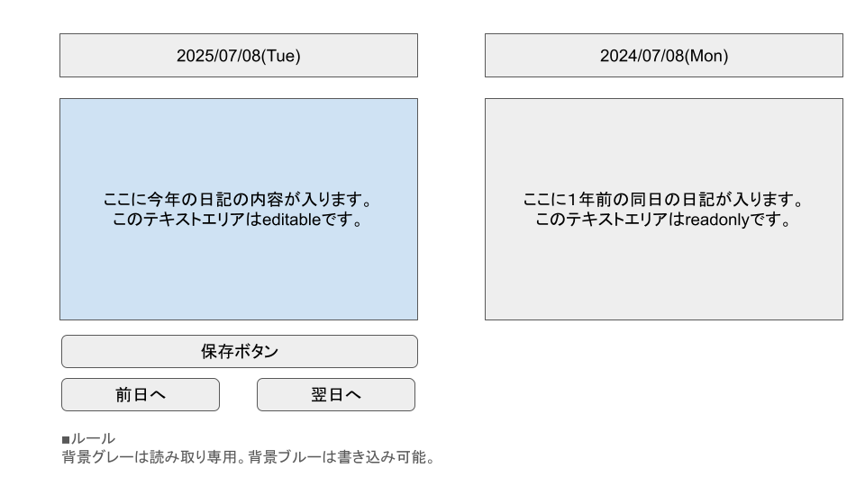

# 日記システム仕様書


## 言葉の定義
- このプロダクトは「日記システム」
- 英語表記は Diary System

## システム環境
- php8.3 + SQLite
- laravel(最新版)
- not use docker (docker は使用しません)

## ディレクトリ
- laravel new で作成するディレクトリはappとしてください


## 画面一覧

### 日記入力＆表示画面
一つの画面に、 日記入力エリアと過去日記表示エリアがある。  



今の日付と日記の内容を入力するフィールド、及び 
１年前の同日の日付と内容が表示されるフィールドがある。

- 日付フィールド: 最大20文字程度
- 日記内容フィールド: 最大1000文字程度
- ボタン
  - 日記を保存する保存ボタン
  - 前日の日記へ移動する前日へボタン
  - 翌日の日記へ移動する翌日へボタン


#### 挙動
- ページロード時にDBからそれぞれのデータを取得し、表示する。
- 保存ボタンを押すと、現在の日記内容を保存します。
- 日記を変更したのに、保存せずページ遷移が発生する場合は警告を出してください

## ログイン＆ユーザー機能
- ログイン＆ユーザー機能はありません。シングルユーザのみです。

## テーブル/Model 構成

### 日記テーブル(diaries)
基本的にLaravelが用意するカラム(created_atやcreated_by)はそのまま。  
soft deleteは使用しません。  

- date: date属性, not null, 日記の日付
- content: string属性, nullable 日記内容


## 初期データ
以下のseederを作成し、Migration後に実行してください。
- Daily Modelに
  - 本日の日記（内容は問いません）
  - 本日からちょうど１年前の日記（内容は問いません）
  - 以下の初期データも追加をお願いします
    - 日付： 2024-01-01
    - content: 今年は仕事が忙しくて実家に帰省できなかったな…。
    - 日付： 2025-01-01
    - content: 今年は実家で楽しく新年を迎えられた。良いことがありそう！

## API

### 同一年日記返却
指定された年の日記を日付の昇順でjson形式で返却します。
- endpoint: /api/diary?year=[yyyy]
- method: get
- return:
``` json
{
  "count": 10,
  "items": [
    {
      "date": "2024-01-01",
      "content": "今日は元日です。書き初めをしました。"
    },
    {
      "date": "2024-01-02",
      "content": "今日はvibe codingをしました。"
    }
  ]
}
```
- yearが与えられなかった場合は理由とともにエラーを返してください。
- 該当データがなかった場合は
```
{
  "count": 0,
  "items": []
}
```
となります。
